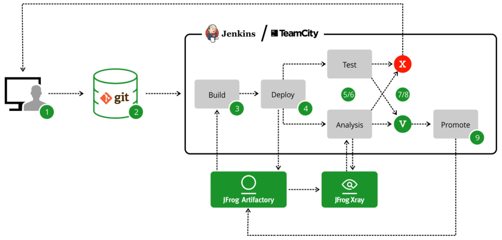
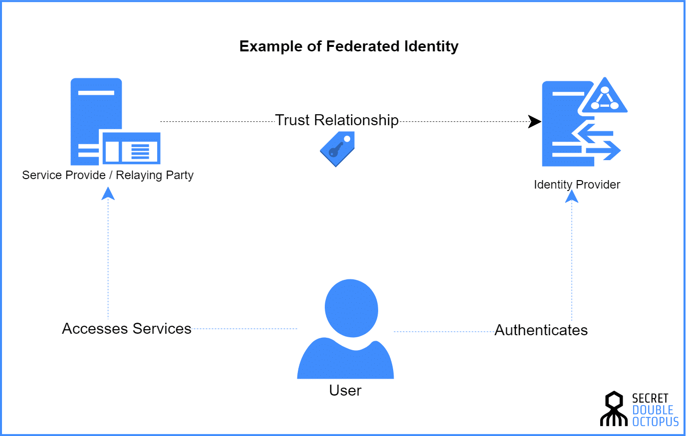

<details>
  <summary>Table of Contents</summary>
  <ol>
    <li><a href="#about-the-project">About The Project</a></li>
    <li><a href="#application-security-introduction">Application Security Introduction</a></li>
      <ol>
        <li><a href="#resources">Resources</a></li>
        <li><a href="#owasp-vs-sans">OWASP VS SANS</a></li>
        <li><a href="#definitions">Definitions</a></li>
        <li><a href="#cve-cvss--cwe">CVE, CVSS & CWE</a></li>
        <li><a href="#api-security">API Security</a></li>
        <li><a href="#owasp-top-ten-additional-notes">OWASP Top Ten (Additional Notes)</a></li>
      </ol>
    <li><a href="#defenses-and-tools">Defenses and Tools</a></li>
    <li><a href="#session-management">Session Management</a></li>
  </ol>
</details>

&nbsp;

## About The Project

- Application Security - The Complete Guide
- Developing security in the Software Development Life Cycle (SDLC)
- [Securely Built](https://securelybuilt.com/)

&nbsp;

---

&nbsp;

## Application Security Introduction


- **Requirements Analysis**
  - High level view of requirements and goals
  - Extracts requirements or requirements analysis
  - Clients have an idea of what they what - not how
  - Scope defined and agreed with
  - Prioritization of requirements
  - Slotting of resources
- **Designing**
  - Describe features and operations
    - Screen layout
    - Business rules
    - Process diagrams
    - Pseudo code and documentation
  - Prototype work
  - Detailed design
    - Technology choices
    - System architecture
- **Implementation**
  - **Input**
    - Requirements
    - Business Process
    - Business Rules
    - Software Design
    - Specifiction
  - **Output**
    - Deliverable Code
- **Testing**
  - Static Analysis: Code testing
  - Dynamic Analysis: Running software testing
  - Unit testing: Verify the functionality of specific code
  - Integration testing: Verify the interfaces between components
  - Interface testing: Testing data passed between units
  - System testing: Testing a completely integrated system
- Evolution
  - Patch
  - Build
  - Test
  - Prod

&nbsp;

---

&nbsp;

- Security is anything you do to protect an **asset** that is vulnerable to some **attack**, **failure**, or **error**
  - An **asset** is anything you deem to have **value**
    - Holds its value
    - Produces value
    - Provides access to value
- A vulnerability is any weakness in an asset that makes it susceptible to attack or failure
- An attack is any **intentional** action that can reduce the value of an asset
- Failures and errors are **unintentional** actions that can reduce the value of an asset
- Attacks, failures, and errors are actions that we collectively refer to as **threats**
- Thus: Security is anything you do to protect an asset that is **vulnerable** to some **threat**

&nbsp;

---

&nbsp;

- The "Anything" Security Goals
  - Security, and more specifically Cybersecurity, can be understood as a set of goals
  - These goals are specifically defined by how we measure an asset's value
  - How does value define our security goals?
  - The goal of security is to protect an asset's **value** from threats
- **Steps**:
  1. Determining what assets we want to protect
  2. Learn how the asset works and interacts with other things
  3. Determine how our asset's value is reduced directly and indirectly
  4. Take steps to mitigate the threats
- We must consider the unique nature of it assets and capabilities when considering security goals
- **CIA**
  - **Confidentiality:** Information is only available to those who should have access
    - When we protect something that provides access value we are maintaining its confidentiality
  - **Integrity:** Data is known to be correct and trusted
    - When we protect something that produces value we are maintaining its availability
  - **Availability:** Information is available for use by legitimate users when it is needed
- [The Protection of Information in Computer Systems](https://web.mit.edu/Saltzer/www/publications/protection/)
- We have well defined goals and security mechanisms, but some mechanisms are better because they fit security principles
  - Security principles aid in selecting or designing the correct mechanisms to implement our goals
    1. **Economy of Mechanism:** Keep things simple so that it is easier to defend
    2. **Fail-Safe Defaults**
    3. **Complete Mediation:** Check every access to the resource for authorization and authority
    4. **Open Design:** There's no security through obscurity
    5. **Separation of Privilege:** Two keys are more secure than one. And you want to make sure that certain activities in certain business, certain business functions within the application or system require especially sensitive ones, require more than one person to perform that activity
    6. **Least Privilege:** Only have access to just what you need to do your job and no more
    7. **Least Common Mechanism:** The least common mechanism means reducing the shared components and systems, since it provides the opportunity for information leaked or inappropriate access
    8. **Psychological Acceptability:** The system needs to be designed so that people do not attempt to circumvent the security
    9. **Work Factor:** The cost of the cost of circumventing the security should exceed the asset. For example, we want to make sure that in order to break encryption that it requires a lot of cost to the attacker that is more expensive that what the actual gain would be
    10. **Compromise Recording:** Audit everything

```
                                       *
                                     *   *
                                    *      *
                                   *  Goals  *          -> C.I.A
                                  *************
                                 *  Principles  *       -> Point 1 to 10
                                ******************
                               *     Mechanisms    *    -> What this course is about
                              ************************
```

&nbsp;

---

&nbsp;

### Resources

- [OWASP Top Ten](https://owasp.org/www-project-top-ten/)
- [OWASP Cheat Sheet Series](https://owasp.org/www-project-cheat-sheets/)
- [OWASP Projects](https://owasp.org/projects/)
- [OWASP WebGoat](https://owasp.org/www-project-webgoat/)
- [OWASP Juice Shop](https://owasp.org/www-project-juice-shop/)
- [OWASP Zed Attack Proxy (ZAP)](https://www.zaproxy.org/)
- [OWASP OWTF](https://owasp.org/www-project-owtf/)
- [OWASP Application Security Verification Standard](https://owasp.org/www-project-application-security-verification-standard/)
- [OWASP Secure Coding Practices-Quick Reference Guide](https://owasp.org/www-project-secure-coding-practices-quick-reference-guide/migrated_content)
- [OWASP Java HTML Sanitizer](https://owasp.org/www-project-java-html-sanitizer/)
- [OWASP CSRFGuard](https://owasp.org/www-project-csrfguard/)
- [OWASP Enterprise Security API (ESAPI)](https://owasp.org/www-project-enterprise-security-api/)
- [OWASP Security Knowledge Framework](https://owasp.org/www-project-security-knowledge-framework/)
- [OWASP Web Security Testing Guide](https://owasp.org/www-project-web-security-testing-guide/)
- [OWASP Dependency-Track](https://owasp.org/www-project-dependency-track/)
- [OWASP Defectdojo](https://owasp.org/www-project-defectdojo/)
- [CWE/SANS TOP 25 Most Dangerous Software Errors](https://www.sans.org/top25-software-errors/)
- [OWASP API Security Top 10 cheat sheet](https://apisecurity.io/encyclopedia/content/owasp/owasp-api-security-top-10-cheat-sheet.htm)

&nbsp;

---

&nbsp;

### OWASP VS SANS

- In developing their Top 25 list, CWE/SANS included a comparision to the OWASP Top Ten making a clear statement of the importance of OWASP's list while also recognizing distinct differences between the two
- Most clearly defined is that the OWASP Top Ten deals strictly with vulnerabilities found in web applications where the Top 25 deals with weaknesses found in desktop and server applications as well
- A further contrast is seen in how the list is compiled. OWASP giving more credence to the risk each vulnerability presents as opposed to the CWE/SANS Top 25 that included the prevalence of each weakness.
- This factor is what gives Cross-site scripting the edge in the Top 25 as it is ranked number 1 while OWASP has it ranked at number 2

&nbsp;

---

&nbsp;

### Definitions

- **Confidentiality:** Concept of preventing the disclosure of information to unauthorized parties
- **Integrity:** Refers to protecting the data from unauthorized alteration
- **Availability:** Access to systems by authorized personnel can be expressed as the system's availability
- **Authentiction:** Authentication is the process of determining the identity of a user
- **Authorization:** Authorization is the process of applying access control rules to a user process, determining whether or not a particular user process can access an object
- **Accounting (Audit):** Accounting is a means of measuring activity.
- **Non-Repudiation:** Non-repudiation is the concept of preventing a subject from denying a previous action with an object in a system
- **Least Privilege:** Subject should have only the necessary rights and privileges to perform its current task with no additional rights and privileges
- **Separation of Duties:** Ensures that for any given task, more than one individual needs to be involved
- **Defense in Depth:** Defense in depth is also known by the terms layered security and diversity defense
- **Fail Safe:** When a system experiences a failure, it should fail to a safe state. (Doors open when there is a power failure)
- **Fail Secure:** The default state is locked or secured. So a fail secure lock locks the door when power is removed
- **Single point of failure:** A single point of failure is any aspect of a system that, if it fails, the entire system fails
- **Threat Actors**
  - Script Kiddie
  - Insider
  - Hacktivist & Terrorist
  - Cybercriminal
  - Advanced Persistent Threat

&nbsp;

---

&nbsp;

### CVE, CVSS & CWE

- **Common Vulnerabilities and Exposure (CVE)** is a list of common identifiers for publicly known cyber security vulnerabilities
  - One identifier for one vulnerability with one standardized description
  - A dictionary rather than a database
  - The way to interoperability and better security coverage
  - A basis for evaluation among services, tools, and databases
  - Industry-endorse via the CVE Numbering Authorities, CVE Board, and numerous products and services that include CV
  - [CVE List Home](https://cve.mitre.org/cve/)
- **Common Vulnerability Scoring System (CVSS)** provides a way to capture the principal characteristics os a vulnerability and produce a numberical score reflecting its severity. The numerical score can then be translated into a qualitative representation (such as low, medium, high, and critical) to help organiations properly assess and prioritize their vulnerability management processes
  - [National Vulnerability Database](https://nvd.nist.gov/vuln-metrics/cvss)
- **Common Weakness Enumeration (CWE)** is a community-developed list of common software security weaknesses. It serves as a common language, a measuring stick for software security tools, and as a baseline for weakness identification, mitigation, and prevention efforts
  - At is core, CWE is a list of software weaknesses types
  - Three types:
    - **Research:** This view is intended to facilitate research into weaknesses, including their inter-dependencies and their role in vulnerabilities
    - **Development:** This view organizes weaknesses aroun concepts that are frequently used or encountered in software development
    - **Architecture:** This view organizes weaknesses according to common architectural security tactics
  - [Common Weakness Enumeration (CWE)](https://cwe.mitre.org/)


- "**Defense In Depth** is an approach to cybersecurity in which a series of defensive mechanisms are layered in order to protect valuable data and information. If one mechanism fails, another steps up immediately to thwart an attack." -ForcePoint
  - Don't rely on Defense In Depth to always protect your app
  - Systems fail, they can be circumvented by the weakest link
  - Your app may not always be behind those defenses


- [Charles](https://www.charlesproxy.com/)
- [Telerik Fiddler](https://www.telerik.com/fiddler)
- Browser "Developer Tools"

&nbsp;

---

&nbsp;

### OWASP Top Ten (Additional Notes)

- **A01 Broken Access Control**
  - **Authentication** is providing and validating identity.
  - **Authorization** includes the execution rules that determines what functionality and data the user (or Principal) may access, ensuring the proper allocation of access rights after authentication is successful.
  - **Access Control**
    - Enforces policy such that users cannot act outside of their intended permissions
    - Failures typically lead to unauthorized information disclosure, modification or destruction of all data, or performing a business function outside of the limits of the user.
    - Weaknesses are common due to the lack of automated detection, and lack of effective functional testing by application developers.
    - The technical impact is attackers acting as users or administrators, or users using privileged funcitons, or creeating, accessing, updating or deleting every record.
- **A02 Cryptographic Failures**
  - **Data Protection**
    - **Protected Health Information (PHI)**
      - Names, dates, phone/ fax numbers, email, SSN, MRN, account numbers, biometric (finger, retinal, voice prints) & images
    - **Personally Identifiable Information (PII)**
      - Name, address, passport, vehicle information, drivers license, credit card numbers, digital identity, birthplace, genetic information and login name
    - **Sensitive Financial Infnormation**
      - Credit/ Debit card numbers and security codes, account numbers, loan agreements, loan details, tax ID & PoS tansactions
- **A03 Injection**
  - **Other Injection Flaws**
    - **OS Command**
    - **LDAP**
    - **XPATH**
- **A04 Insecure Design**
  - **Bad Bots**
    - A retail chain's e-commerce website does not have protection against bots run by scalpers buying high-end video cards to resell auction websites. This creates terrible publicity for the video card makers and retails chain owners and enduring bad blood with enthusiasts who cannot obtain these cards at any price. Careful anti-bot design and domain logic rules, such as purchases made within a few seconds of availability, might identify inauthentic purchases and rejected such transactions.
- **A05 Security Misconfiguration**
  - Absence of security settings in:
    - Application
    - Framework
    - Database
    - Web server
    - Platform
  - Default settings in the cloud
  - A cloud service provider (CSP) has default sharing permissions open to the Internet by other CSP users. This allows sensitive data stored within cloud storage to be accessed.
- **A06 Vulnerable and Outdated Components**
  - Most applicaions include either commercial products or Open Source Software(OSS) within their software bundles.
    - Find a solution like **Dependency Check**, GitLab, or Jfrog Xray, to automatically scan for vulnerable packages.
  - For commercial products, most major vendors such as Oracle, Google and IBM provide **Security Bulletins to distribution lists** for notification purposes. Make sure you are signed up for these services.
    - [Sign-up](https://nvd.nist.gov/general/email-list) for regular security bullets from the National Vulnerability Database and regularly monitor components for security issues and updated versions.
  - **Notification**
    - Have means for receiving notifications on ptentially vulnerable software.
    - Many vendors like Microsoft already offer a notification service, however other services or feeds exist.
    - Receiving notification is only part of the solution. You must also be able to:
      - Know where to patch (what systems or software arre vulnerable)
      - Have the ability to test the new patch
      - Have a means to deliver the patch
      - Ability to notify those impacted by the changes to teh system (users, customers, etc)
  - **Patching Process**
    - Development -> Pre Prod -> Production
    - Testing conducted at Development and Pre Prod
- **A07 Identification and Authentication Failures**
  - Attacks:
    - Password guessing attack (social engineering)
      - John from IT, needs your help
    - Dictionary attack
      - Dictionary words that are hased and tests
    - Brute force attack
      - Guessing or targeted hashes
    - Username enumeration
      - Guessable patterns of usernames or log in failure messages that reveal too much
    - Phishing
      - Trick users into providing their credentials to an imposter, look-alike site
  - Account Recovery Risks:
    - Social engineering
      - Emailing a password reset form without using something like two factor
    - Easily guessable security answers
      - Answers that can be easily found online
      - "What school did you attend?"
    - Password sent through insecure channels
      - Email
    - Password change not required
      - Once you've been given a new password, it should be changed on the next login
- **A08 Software and Data Integrity Failures**
  - **Case Study:** [NPR - A 'Worst Nightmare' Cyberattack: The Untold Story Of The SolarWinds Hack](https://www.npr.org/2021/04/16/985439655/a-worst-nightmare-cyberattack-the-untold-story-of-the-solarwinds-hack)
- **A09 Security Logging and Monitoring Failures**
  - Security Information and Event Management (SIEM)


- **A10 Server-Side Request Forgery (SSRF)**


&nbsp;

---

&nbsp;

## Defenses and Tools

- **Cross Site Scripting (XSS)** is a type of computer security vulnerability typically found in web applications. XSS enables attackers to inject client-side scripts into web pages viewed by other users. A cross-site scripting vulnerability may be used by attackers to bypass access controls such as the same-origin policy.
- This subversion is possible because the wb application fails to properly validate input from the web browser (i.e., client) and/ or fails to properly escape that input in the response.


&nbsp;


- **Content Security Policy (CSP)**
  - [MDN - CSP](https://developer.mozilla.org/en-US/docs/Web/HTTP/CSP)
  - Is an added layer of security that helps to detect and mitigate certain types of attacks, including XSS and data injection attacks.
  - To enable CSP, you need to configure your web server to return the Content-Security-Policy HTTP header.
  - Browsers that don't support it still work with servers that implement it, and vice-versa: browsers that don't support CSP simply ignore it, functioning as usual, defaulting to the standard same-orign policy for web content.
  - **Mitigating XSS**
    - CSP makes it possible for server administrators to reduce or eliminate the vectors by which XSS can occur by specifying the domains that the browser should consider to be valid sources of executable scripts.
    - A CSP compatible browser will then only execute scripts loaded in source files received from those whitelisted domains, ignoring all other script (including inline scripts and event-handling HTML attributes).
    - As an ultimate form of protection, sites that want to never allow scripts to be executed can opt to globally disallow script execution.
  - **Writing a policy**
    - A policy is described using a series of policy directives, each of which describes the policy for a certain resource type or policy area.
    - Your policy should include a default-src policy directive, which is a fallback for other resource types when they don't have policies of their own.
    - A policy needs to include a default-src or script-src directive to prevent inline scripts from running, as well as blocking the use of eval().
    - A policy needs to include a default-src directive to restrict inline styles from being applied from a `<style>` element or a style attribute.
  - **Example:** This policy allows images, scripts, AJAX, and CSS from the same origin, and does not allow any other resources to load (eg. object, frame, media, etc)
    - `Content-Security-Policy: default-src'none'; script-src'self'; connect-src 'self'; img-src 'self'; style-src 'self';`
  - [CSP Evaluator](https://csp-evaluator.withgoogle.com/)


- **Security Model** are used to understand the systems and processes developed to enforce security principles.
  - 3 key elements play a role in systems with respect to model implementation:
    - People
    - Processes
    - Technology
  - Addressing a single element of the 3 may provide benefits, but more effectiveness can be achieved through addressing multiple elements.
  - Access Control Models
    - [Fundamental Concepts of Security Models & how they work](https://ipspecialist.net/fundamental-concepts-of-security-models-how-they-work/)
    - [Introduction To Classic Security Models](https://www.geeksforgeeks.org/introduction-to-classic-security-models/)
    - Access Control List (ACL)
    - Bell-LaPadula model
    - Role-based Access Control
    - Access-based Access Control
    - Biba Integrity Model
    - Clark-Wilson Model
    - Brewer-Nash Model (Chinese Wall)
    - Data Flow Diagrams
    - Use Case Models
    - Assurance Models
- **Software Composition Analysis(SCA)**
  - SCA is the process of validating that the components, libraries, and opensource software that is used in an application is free from known vulnerabilities and license compliance.
  - These external software components can come from several places:
    - Downloads, commercial applications, third-aprty libraries and software, and from outsourced development by consulting
  - SCA can provide:
    - Component tracking and inventory
    - Vulnerability identification and remediation recommendation
    - License management
  - [OWASP Dependency-Check](https://owasp.org/www-project-dependency-check/)
  - [JFrog Xray](https://jfrog.com/xray/)


&nbsp;


&nbsp;



- **Security Knowledge Framework (SKF)**
  - [Security Knowledge Framework Demo](https://demo.securityknowledgeframework.org/dashboard)
  - **Why**
    - Security by design
    - Information is hard to find
    - Examples lack security details
    - Security is hard
    - Together we can create secure web applications
    - Defensive coding approach
    - SKF is the first step in SDLC
  - **How SKF can be used**
    - Security Requirements OWASP ASVS for development and for third party vendor applications
    - Security knowledge reference (Code examples/ Knowledge Base items)
    - Security is part of design with the pre-development functionality in SKF
    - Security post-development functionality in SKF for verification with the OWASP ASVS
  - **Pre development stage**
    - Here we detect threats beforehand and we provide developers with secure development patterns as well as providing feedback and solutions on how to handle their threats.
  - **Post development stage**
    - By means of checklists we guide developers through a process where we harden their application infrastructure and functions by providing feedback and solutions
- **Source Code Review**
  - **Who to include**
    - Developers
    - Architects
    - Security SME (Subject Matter Expert)
    - Depending on the portion of the application you may need to include the SME for that topic (Authentication, DB logic, User Experience...)
  - **Scope and aid**
    - Code reviews should take into consideration the threat model and high-risk transactions in the application.
    - A completed threat model will highlight the areas of concern.
    - Any time code is added/ updated in those high-risk areas a code review should include a security component.
    - When changes are required to the threat model due to findings during that code review, the threat model should ber updated.
  - **Understand the risk**
    - **Ease of Exposure:**
      - Is the code change in a piece of code directly exposed to the internet?
      - Does an insider use the interface directly?
    - **Value of Loss:**
      - How much could be lost if the module has a vulnerability introduced?
      - Does the module contain some critical passsword hashing mechanism, or a simple change to HTML border on some internal test tool?
    - **Regulatory Controls:**
      - If a piece of code implements business logic associated with a standard that must be complied with, then these modules can be considered high risk as the penalties for non-conformity can be high.
    - When considering the risk of code under review, consider some common criteria for establishing risk of a particular code module. The higher the risk, the more thorough the review should be.
  - **Understanding**
    - Application features and business logic
    - Context/ Sensitive Data
    - The code (language, feature, nuance of language)
    - User roles and access rights (anonymous access?)
    - Application type (mobile, desktop, web)
    - Design and architecture of the application
    - Company standards, guidelines and requirements that apply
    - The reviewer will need certain information about the development in order to be effective.
      - Design documents, business requirements, functional specifications, test results, and the like.
    - If the reviwer is not part of the development team, they need to talk wit the developers and the lead architect for the application and get a sense of the application.
      - Does not have to be a long meeting, it could be a whiteboard session for the development team to share some basic information about the key security considerations and controls
  - **Information gathering tips**
    - Walkthrough of the actual running application.
    - A brief overview of the structure of the code base and any libraries.
    - Knowing the architecture of the application goes a long way in understanding the security threats that are applicable.
      - Tech stack, deployment, users and data
    - All the required information of the proposed design including flow charts, sequence diagrams, class diagrams and requirements documents to understand the objective of the proposed design should be used as reference during the review.
  - **Using the checklist**
    - When using the Code Review Checklist Template, the reviewer may filter out non-applicable categories.
    - It is recommneded that the complete list is used for code that is high risk. For instance, code that impacts patient safety workflows or mission critical functionality shall use the complete code review list.
    - The code review template should be completed and appended during code check-in in the code repository or with the completed code review using a tool (for instance Crucible).
  - **When to peform the review**
    - **Code:** Code review during pre-commit means that dangerous or sub-par code does not make it to the code branch. However this does reduce the time to delivery of new code.
    - **Post:** Post-commit allows for faster delivery of software but runs the risk of allowing dangerous code into the branch. Other developers may also add their code which can make future reviews more cumbersome.
    - **Audit:** During a code audit can be triggered by an even such as a found vulnerability and should review the entire area of concern rather than focus on a single code commit.
  - **What to do with results**
    - A vulnerability or risk found during a code review should be addressed immediately if found in the pre-commit phase, however there may be cases when code cannot be mitigated, or issues are found after code has been committed. In those cases, go through a Risk Rating to determine its impact and understand the timeframe for remediation.
- [OWASP Secure Coding Dojo](https://owasp.org/www-project-secure-coding-dojo/)
- [OWASP Code Review Guide](https://owasp.org/www-project-code-review-guide/)

&nbsp;

---

&nbsp;

## Session Management

- **Sessions** ensures the ability to identify the user on any subsequent requests as well as being able to apply security access controls, authorized access to the user private data, and to increase the usability of the applicaton. Therefore, current web applications can provide session capabilities both pre and post authntication. Once an authenticated session has been established, the session ID (or token) is temporarily equivalent to the strongest authentication method used by the application.
  - Such as username and password, passphrases, one-time passwords (OTP), client-based digital certificates, smartcards, or biometrics (such as figngerprint or eye retina).
- **HTTP** is a stateless protocol where each request and response pair is independent of other web interactions.
- Session management links both the authentication and authorization modules commonly avilable in web applications:
  - The **session ID** or **token binds** the user authentication credentials to the user HTTP traffic and the appropraite access controls enforced by the web application.
  - The complexity of these components in modern web applications, plus the fact that its implementation and binding resides on the web developer's hands makes the implementation of a secure session management module very challenging.
- **Pre-Auth Sessions -> Authentication -> Session Management -> Access Control -> Session Finalization**
- Since HTTP and Web Server both are **stateless**, the only way to maintain a session is when some unique information about the session (session id) is passed between server and client in very request and response.
- **Methods of Session Management:**
  - **User Authentication:** Common for a user to provide authentication credentials from the login page and then the authentication information is passed between server and client to maintain the session.
  - **HTML Hidden Field:** A unique hidden field in the hTML and when user starts navigating, we can set its value unique to the user and keep track of the session.
  - **URL Rewriting:** A session identifier parameter is appended to every request and response to keep track of the session.
  - **Cookies:** Cookies are small piece of information that are sent by the web server in the response header and gets stored in the browser cookies. When client make further request, it adds the cookie to the request header to keep track of the session.

&nbsp;

- **Federated Identity**
  - A federated identity in information technology is the means of linking a person's electronic identity and attributes, stored across multiple distinct **identity mangement** systems.
  - [Federated identity is related to single sign-on (SSO)](https://doubleoctopus.com/blog/standards-regulations/federated-identity-vs-single-sign-on/), in which a user's single authentication ticket, or token, is trusted across multiple IT systems or even organizations.
  - The "federation" of identity, describes the technologies, standards and use-cases which serve to enable the portability of identity information across otherwise autonomous security domains.
  - Technologies:
    - SAML (Security Assertion Markup Language)
    - OAuth
    - OpenID
    - Security Tokens (Simple Web Tokens, JSON Web Tokens, and SAML assertions)
    - Web Service Specifications, and Windows Identity Foundation



&nbsp;

---

&nbsp;

> **Ivan:** Are GUIDs should be considerable as un-guessable?
> At 03:58 it was claimed that using GUIDs are recommendable way to creating un-guessable session IDs. It looks like that this statement should be revised, because according to ["Security Considerations" section of RFC 4122](tools.ietf.org/html/rfc4122#section-6) the UUIDs should not be assumed as hard guessable.
>
> Also, Raymond Chen also mentioned [that](devblogs.microsoft.com/oldnewthing/20150701-00/?p=45241), as a rule of thumb, GUIDs are for uniqueness, not for randomness.

> **Derek:** Depending on your use case a GUID is still considered sufficient. You may also generate your GUIDs using v4 GUID algorithm, and a cryptograpically secure psuedo random number generator. In any case, it's important to understand what your user case is and level of risk tolerance is in order to determine your best path forward. Hope that helps.

&nbsp;

---

&nbsp;

- **Java Session Management = HTTPSESSION**
  - Servlet API provides Session management through HttpSession interface. We can get session from HttpServletRequest object using following methods. HttpSession allows us to set objects as attributes that can be retrieved in future requests.
    - `HttpSession getSesssion()`
    - `HttpSession getSession(boolean flag)`
  - When `HttpServletRequest getSession()` does not return an active session, then it creates the new HttpSession object and adds a Cookie to the response object with name JSESSIONID and value as session id.
  - This cookie is used to identify the HttpSession object in further requests from client.
  - There may be times where the browser has cookies disabled.
  - The application may choose to pass session information in the URL
  - The URL can be encoded with `HttpServletResponse encodeURL()` method
    - In a redirect the request to another resource can be encoded with `encodedRedirectURL()` method.
  - However, there is a clear security concern with the session in the URL


- **.NET Sessions**
  - **.Net Session Management**
    - .NET session state supports several different storage options for session data. Each option is identified by a value in the `SessionStateMode` enumeration. The following list describes the avaialble session state modes:
    - You can specify which mode you want .NET session state to use by assigning a `SessionStateMode` enumeration values to the `mode` attribute of the sessionState element in your application's `Web.config` file. Modes other than `InProc` and `Off` require additonal parameters, such as connetion-string values.
    - `Custom`
    - `InProc`
    - `Off`
    - `SQLServer`
    - `StateServer`

&nbsp;

- [JSON Web Token](https://jwt.io/)
- [OAuth Community Site](https://oauth.net/)
- [OpenID](https://openid.net/)
- [OpenID Connect](https://developers.google.com/identity/protocols/oauth2/openid-connect)
- **OAuth & OpenID Connect**
  - OAuth is directly related to OpenID Connect (OIDC) since OIDC is an authentication layer built on top of OAuth 2.0. OAuth is also distinct from XACML, which is authorization policy standard.
  - OAuth can be used in conjunction with XACML where OAuth is used for ownership consent and access delegation whereas XACML is used to define the authorization policies (e.g. managers can view documents in their region).
- **What is OpenID Connect**
  - OpenID Connect 1.0 is a simple identity layer on top of the OAuth 2.0 protocol.
  - It allows Clients to verify the identity of the End-User based on the authentication performed by an Authorization Server, as well as to obtain basic profile information about the End-User in an interoperable and REST-like manner.
  - OpenID Connect allows clients of all types, including Web-based, mobile, and JavaScript clients, to request and receive information about authenticated sessions and end-users.
  - The specification suite is extensible, allowing participants to use optional features such as encryption of identity data, discovery of OpenID Providers, and session mangement, when it makes sense for them.


&nbsp;

---

&nbsp;
