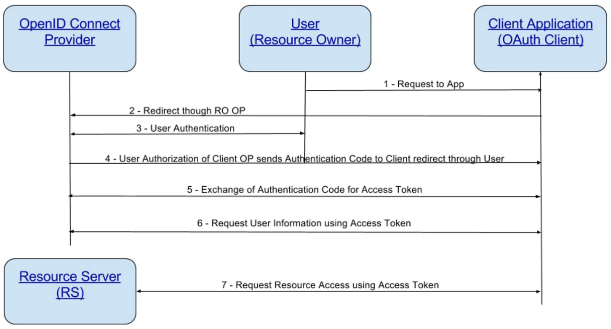

<details>
  <summary>Table of Contents</summary>
  <ol>
    <li><a href="#about-the-project">About The Project</a></li>
    <li><a href="#application-security-introduction">Application Security Introduction</a></li>
      <ol>
        <li><a href="#resources">Resources</a></li>
        <li><a href="#owasp-vs-sans">OWASP VS SANS</a></li>
        <li><a href="#definitions">Definitions</a></li>
        <li><a href="#cve-cvss--cwe">CVE, CVSS & CWE</a></li>
        <li><a href="#api-security">API Security</a></li>
        <li><a href="#owasp-top-ten-additional-notes">OWASP Top Ten (Additional Notes)</a></li>
      </ol>
    <li><a href="#defenses-and-tools">Defenses and Tools</a></li>
    <li><a href="#session-management">Session Management</a></li>
    <li><a href="#risk-rating">Risk Rating</a></li>
    <li><a href="#threat-modeling">Threat Modeling</a></li>
      <ol>
        <li><a href="#threat-models-manual-vs-tool">Threat Models (Manual VS Tool)</a></li>
        <li><a href="#retail-store-user-stories">Retail Store User Stories</a></li>
        <li><a href="#microsoft-threat-model-tool">Microsoft Threat Model Tool</a></li>
      </ol>
    <li><a href="#encryption">Encryption</a></li>
    <li><a href="#hashing">Hashing</a></li>
    <li><a href="#public-key-infrastructure-pki">Public Key Infrastructure (PKI)</a></li>
    <li><a href="#password-handling">Password Handling</a></li>
    <li><a href="#frameworks-and-process">Frameworks and Process</a></li>
    <li><a href="#security-scanning-and-testing">Security Scanning and Testing</a></li>
  </ol>
</details>

&nbsp;

## About The Project

- Application Security - The Complete Guide
- Developing security in the Software Development Life Cycle (SDLC)
- [Securely Built](https://securelybuilt.com/)

&nbsp;

---

&nbsp;

## Application Security Introduction


- **Requirements Analysis**
  - High level view of requirements and goals
  - Extracts requirements or requirements analysis
  - Clients have an idea of what they what - not how
  - Scope defined and agreed with
  - Prioritization of requirements
  - Slotting of resources
- **Designing**
  - Describe features and operations
    - Screen layout
    - Business rules
    - Process diagrams
    - Pseudo code and documentation
  - Prototype work
  - Detailed design
    - Technology choices
    - System architecture
- **Implementation**
  - **Input**
    - Requirements
    - Business Process
    - Business Rules
    - Software Design
    - Specification
  - **Output**
    - Deliverable Code
- **Testing**
  - Static Analysis: Code testing
  - Dynamic Analysis: Running software testing
  - Unit testing: Verify the functionality of specific code
  - Integration testing: Verify the interfaces between components
  - Interface testing: Testing data passed between units
  - System testing: Testing a completely integrated system
- Evolution
  - Patch
  - Build
  - Test
  - Prod

&nbsp;

---

&nbsp;

- Security is anything you do to protect an **asset** that is vulnerable to some **attack**, **failure**, or **error**
  - An **asset** is anything you deem to have **value**
    - Holds its value
    - Produces value
    - Provides access to value
- A vulnerability is any weakness in an asset that makes it susceptible to attack or failure
- An attack is any **intentional** action that can reduce the value of an asset
- Failures and errors are **unintentional** actions that can reduce the value of an asset
- Attacks, failures, and errors are actions that we collectively refer to as **threats**
- Thus: Security is anything you do to protect an asset that is **vulnerable** to some **threat**

&nbsp;

---

&nbsp;

- The "Anything" Security Goals
  - Security, and more specifically Cybersecurity, can be understood as a set of goals
  - These goals are specifically defined by how we measure an asset's value
  - How does value define our security goals?
  - The goal of security is to protect an asset's **value** from threats
- **Steps**:
  1. Determining what assets we want to protect
  2. Learn how the asset works and interacts with other things
  3. Determine how our asset's value is reduced directly and indirectly
  4. Take steps to mitigate the threats
- We must consider the unique nature of it assets and capabilities when considering security goals
- **CIA**
  - **Confidentiality:** Information is only available to those who should have access
    - When we protect something that provides access value we are maintaining its confidentiality
  - **Integrity:** Data is known to be correct and trusted
    - When we protect something that produces value we are maintaining its availability
  - **Availability:** Information is available for use by legitimate users when it is needed
- [The Protection of Information in Computer Systems](https://web.mit.edu/Saltzer/www/publications/protection/)
- We have well defined goals and security mechanisms, but some mechanisms are better because they fit security principles
  - Security principles aid in selecting or designing the correct mechanisms to implement our goals
    1. **Economy of Mechanism:** Keep things simple so that it is easier to defend
    2. **Fail-Safe Defaults**
    3. **Complete Mediation:** Check every access to the resource for authorization and authority
    4. **Open Design:** There's no security through obscurity
    5. **Separation of Privilege:** Two keys are more secure than one. And you want to make sure that certain activities in certain business, certain business functions within the application or system require especially sensitive ones, require more than one person to perform that activity
    6. **Least Privilege:** Only have access to just what you need to do your job and no more
    7. **Least Common Mechanism:** The least common mechanism means reducing the shared components and systems, since it provides the opportunity for information leaked or inappropriate access
    8. **Psychological Acceptability:** The system needs to be designed so that people do not attempt to circumvent the security
    9. **Work Factor:** The cost of the cost of circumventing the security should exceed the asset. For example, we want to make sure that in order to break encryption that it requires a lot of cost to the attacker that is more expensive that what the actual gain would be
    10. **Compromise Recording:** Audit everything

```
                                       *
                                     *   *
                                    *      *
                                   *  Goals  *          -> C.I.A
                                  *************
                                 *  Principles  *       -> Point 1 to 10
                                ******************
                               *     Mechanisms    *    -> What this course is about
                              ************************
```

&nbsp;

---

&nbsp;

### Resources

- [OWASP Top Ten](https://owasp.org/www-project-top-ten/)
- [OWASP Cheat Sheet Series](https://owasp.org/www-project-cheat-sheets/)
- [OWASP Projects](https://owasp.org/projects/)
- [OWASP WebGoat](https://owasp.org/www-project-webgoat/)
- [OWASP Juice Shop](https://owasp.org/www-project-juice-shop/)
- [OWASP Zed Attack Proxy (ZAP)](https://www.zaproxy.org/)
- [OWASP OWTF](https://owasp.org/www-project-owtf/)
- [OWASP Application Security Verification Standard](https://owasp.org/www-project-application-security-verification-standard/)
- [OWASP Secure Coding Practices-Quick Reference Guide](https://owasp.org/www-project-secure-coding-practices-quick-reference-guide/migrated_content)
- [OWASP Java HTML Sanitizer](https://owasp.org/www-project-java-html-sanitizer/)
- [OWASP CSRFGuard](https://owasp.org/www-project-csrfguard/)
- [OWASP Enterprise Security API (ESAPI)](https://owasp.org/www-project-enterprise-security-api/)
- [OWASP Security Knowledge Framework](https://owasp.org/www-project-security-knowledge-framework/)
- [OWASP Web Security Testing Guide](https://owasp.org/www-project-web-security-testing-guide/)
- [OWASP Dependency-Track](https://owasp.org/www-project-dependency-track/)
- [OWASP Defectdojo](https://owasp.org/www-project-defectdojo/)
- [CWE/SANS TOP 25 Most Dangerous Software Errors](https://www.sans.org/top25-software-errors/)
- [OWASP API Security Top 10 cheat sheet](https://apisecurity.io/encyclopedia/content/owasp/owasp-api-security-top-10-cheat-sheet.htm)

&nbsp;

---

&nbsp;

### OWASP VS SANS

- In developing their Top 25 list, CWE/SANS included a comparison to the OWASP Top Ten making a clear statement of the importance of OWASP's list while also recognizing distinct differences between the two
- Most clearly defined is that the OWASP Top Ten deals strictly with vulnerabilities found in web applications where the Top 25 deals with weaknesses found in desktop and server applications as well
- A further contrast is seen in how the list is compiled. OWASP giving more credence to the risk each vulnerability presents as opposed to the CWE/SANS Top 25 that included the prevalence of each weakness.
- This factor is what gives Cross-site scripting the edge in the Top 25 as it is ranked number 1 while OWASP has it ranked at number 2

&nbsp;

---

&nbsp;

### Definitions

- **Confidentiality:** Concept of preventing the disclosure of information to unauthorized parties
- **Integrity:** Refers to protecting the data from unauthorized alteration
- **Availability:** Access to systems by authorized personnel can be expressed as the system's availability
- **Authentication:** Authentication is the process of determining the identity of a user
- **Authorization:** Authorization is the process of applying access control rules to a user process, determining whether or not a particular user process can access an object
- **Accounting (Audit):** Accounting is a means of measuring activity.
- **Non-Repudiation:** Non-repudiation is the concept of preventing a subject from denying a previous action with an object in a system
- **Least Privilege:** Subject should have only the necessary rights and privileges to perform its current task with no additional rights and privileges
- **Separation of Duties:** Ensures that for any given task, more than one individual needs to be involved
- **Defense in Depth:** Defense in depth is also known by the terms layered security and diversity defense
- **Fail Safe:** When a system experiences a failure, it should fail to a safe state. (Doors open when there is a power failure)
- **Fail Secure:** The default state is locked or secured. So a fail secure lock locks the door when power is removed
- **Single point of failure:** A single point of failure is any aspect of a system that, if it fails, the entire system fails
- **Threat Actors**
  - Script Kiddie
  - Insider
  - Hacktivist & Terrorist
  - Cybercriminal
  - Advanced Persistent Threat

&nbsp;

---

&nbsp;

### CVE, CVSS & CWE

- **Common Vulnerabilities and Exposure (CVE)** is a list of common identifiers for publicly known cyber security vulnerabilities
  - One identifier for one vulnerability with one standardized description
  - A dictionary rather than a database
  - The way to interoperability and better security coverage
  - A basis for evaluation among services, tools, and databases
  - Industry-endorse via the CVE Numbering Authorities, CVE Board, and numerous products and services that include CV
  - [CVE List Home](https://cve.mitre.org/cve/)
- **Common Vulnerability Scoring System (CVSS)** provides a way to capture the principal characteristics os a vulnerability and produce a numerical score reflecting its severity. The numerical score can then be translated into a qualitative representation (such as low, medium, high, and critical) to help organizations properly assess and prioritize their vulnerability management processes
  - [National Vulnerability Database](https://nvd.nist.gov/vuln-metrics/cvss)
- **Common Weakness Enumeration (CWE)** is a community-developed list of common software security weaknesses. It serves as a common language, a measuring stick for software security tools, and as a baseline for weakness identification, mitigation, and prevention efforts
  - At is core, CWE is a list of software weaknesses types
  - Three types:
    - **Research:** This view is intended to facilitate research into weaknesses, including their inter-dependencies and their role in vulnerabilities
    - **Development:** This view organizes weaknesses around concepts that are frequently used or encountered in software development
    - **Architecture:** This view organizes weaknesses according to common architectural security tactics
  - [Common Weakness Enumeration (CWE)](https://cwe.mitre.org/)


- "**Defense In Depth** is an approach to cybersecurity in which a series of defensive mechanisms are layered in order to protect valuable data and information. If one mechanism fails, another steps up immediately to thwart an attack." -ForcePoint
  - Don't rely on Defense In Depth to always protect your app
  - Systems fail, they can be circumvented by the weakest link
  - Your app may not always be behind those defenses


- [Charles](https://www.charlesproxy.com/)
- [Telerik Fiddler](https://www.telerik.com/fiddler)
- Browser "Developer Tools"

&nbsp;

---

&nbsp;

### OWASP Top Ten (Additional Notes)

- **A01 Broken Access Control**
  - **Authentication** is providing and validating identity.
  - **Authorization** includes the execution rules that determines what functionality and data the user (or Principal) may access, ensuring the proper allocation of access rights after authentication is successful.
  - **Access Control**
    - Enforces policy such that users cannot act outside of their intended permissions
    - Failures typically lead to unauthorized information disclosure, modification or destruction of all data, or performing a business function outside of the limits of the user.
    - Weaknesses are common due to the lack of automated detection, and lack of effective functional testing by application developers.
    - The technical impact is attackers acting as users or administrators, or users using privileged functions, or creating, accessing, updating or deleting every record.
- **A02 Cryptographic Failures**
  - **Data Protection**
    - **Protected Health Information (PHI)**
      - Names, dates, phone/ fax numbers, email, SSN, MRN, account numbers, biometric (finger, retinal, voice prints) & images
    - **Personally Identifiable Information (PII)**
      - Name, address, passport, vehicle information, drivers license, credit card numbers, digital identity, birthplace, genetic information and login name
    - **Sensitive Financial Information**
      - Credit/ Debit card numbers and security codes, account numbers, loan agreements, loan details, tax ID & PoS transactions
- **A03 Injection**
  - **Other Injection Flaws**
    - **OS Command**
    - **LDAP**
    - **XPATH**
- **A04 Insecure Design**
  - **Bad Bots**
    - A retail chain's e-commerce website does not have protection against bots run by scalpers buying high-end video cards to resell auction websites. This creates terrible publicity for the video card makers and retails chain owners and enduring bad blood with enthusiasts who cannot obtain these cards at any price. Careful anti-bot design and domain logic rules, such as purchases made within a few seconds of availability, might identify inauthentic purchases and rejected such transactions.
- **A05 Security Misconfiguration**
  - Absence of security settings in:
    - Application
    - Framework
    - Database
    - Web server
    - Platform
  - Default settings in the cloud
  - A cloud service provider (CSP) has default sharing permissions open to the Internet by other CSP users. This allows sensitive data stored within cloud storage to be accessed.
- **A06 Vulnerable and Outdated Components**
  - Most applications include either commercial products or Open Source Software(OSS) within their software bundles.
    - Find a solution like **Dependency Check**, GitLab, or Jfrog Xray, to automatically scan for vulnerable packages.
  - For commercial products, most major vendors such as Oracle, Google and IBM provide **Security Bulletins to distribution lists** for notification purposes. Make sure you are signed up for these services.
    - [Sign-up](https://nvd.nist.gov/general/email-list) for regular security bullets from the National Vulnerability Database and regularly monitor components for security issues and updated versions.
  - **Notification**
    - Have means for receiving notifications on potentially vulnerable software.
    - Many vendors like Microsoft already offer a notification service, however other services or feeds exist.
    - Receiving notification is only part of the solution. You must also be able to:
      - Know where to patch (what systems or software are vulnerable)
      - Have the ability to test the new patch
      - Have a means to deliver the patch
      - Ability to notify those impacted by the changes to teh system (users, customers, etc)
  - **Patching Process**
    - Development -> Pre Prod -> Production
    - Testing conducted at Development and Pre Prod
- **A07 Identification and Authentication Failures**
  - Attacks:
    - Password guessing attack (social engineering)
      - John from IT, needs your help
    - Dictionary attack
      - Dictionary words that are hashed and tests
    - Brute force attack
      - Guessing or targeted hashes
    - Username enumeration
      - Guessable patterns of usernames or log in failure messages that reveal too much
    - Phishing
      - Trick users into providing their credentials to an imposter, look-alike site
  - Account Recovery Risks:
    - Social engineering
      - Emailing a password reset form without using something like two factor
    - Easily guessable security answers
      - Answers that can be easily found online
      - "What school did you attend?"
    - Password sent through insecure channels
      - Email
    - Password change not required
      - Once you've been given a new password, it should be changed on the next login
- **A08 Software and Data Integrity Failures**
  - **Case Study:** [NPR - A 'Worst Nightmare' Cyberattack: The Untold Story Of The SolarWinds Hack](https://www.npr.org/2021/04/16/985439655/a-worst-nightmare-cyberattack-the-untold-story-of-the-solarwinds-hack)
- **A09 Security Logging and Monitoring Failures**
  - Security Information and Event Management (SIEM)


- **A10 Server-Side Request Forgery (SSRF)**


&nbsp;

---

&nbsp;

## Defenses and Tools

- **Cross Site Scripting (XSS)** is a type of computer security vulnerability typically found in web applications. XSS enables attackers to inject client-side scripts into web pages viewed by other users. A cross-site scripting vulnerability may be used by attackers to bypass access controls such as the same-origin policy.
- This subversion is possible because the wb application fails to properly validate input from the web browser (i.e., client) and/ or fails to properly escape that input in the response.


&nbsp;


- **Content Security Policy (CSP)**
  - [MDN - CSP](https://developer.mozilla.org/en-US/docs/Web/HTTP/CSP)
  - Is an added layer of security that helps to detect and mitigate certain types of attacks, including XSS and data injection attacks.
  - To enable CSP, you need to configure your web server to return the Content-Security-Policy HTTP header.
  - Browsers that don't support it still work with servers that implement it, and vice-versa: browsers that don't support CSP simply ignore it, functioning as usual, defaulting to the standard same-origin policy for web content.
  - **Mitigating XSS**
    - CSP makes it possible for server administrators to reduce or eliminate the vectors by which XSS can occur by specifying the domains that the browser should consider to be valid sources of executable scripts.
    - A CSP compatible browser will then only execute scripts loaded in source files received from those whitelisted domains, ignoring all other script (including inline scripts and event-handling HTML attributes).
    - As an ultimate form of protection, sites that want to never allow scripts to be executed can opt to globally disallow script execution.
  - **Writing a policy**
    - A policy is described using a series of policy directives, each of which describes the policy for a certain resource type or policy area.
    - Your policy should include a default-src policy directive, which is a fallback for other resource types when they don't have policies of their own.
    - A policy needs to include a default-src or script-src directive to prevent inline scripts from running, as well as blocking the use of eval().
    - A policy needs to include a default-src directive to restrict inline styles from being applied from a `<style>` element or a style attribute.
  - **Example:** This policy allows images, scripts, AJAX, and CSS from the same origin, and does not allow any other resources to load (eg. object, frame, media, etc)
    - `Content-Security-Policy: default-src'none'; script-src'self'; connect-src 'self'; img-src 'self'; style-src 'self';`
  - [CSP Evaluator](https://csp-evaluator.withgoogle.com/)


- **Security Model** are used to understand the systems and processes developed to enforce security principles.
  - 3 key elements play a role in systems with respect to model implementation:
    - People
    - Processes
    - Technology
  - Addressing a single element of the 3 may provide benefits, but more effectiveness can be achieved through addressing multiple elements.
  - Access Control Models
    - [Fundamental Concepts of Security Models & how they work](https://ipspecialist.net/fundamental-concepts-of-security-models-how-they-work/)
    - [Introduction To Classic Security Models](https://www.geeksforgeeks.org/introduction-to-classic-security-models/)
    - Access Control List (ACL)
    - Bell-LaPadula model
    - Role-based Access Control
    - Access-based Access Control
    - Biba Integrity Model
    - Clark-Wilson Model
    - Brewer-Nash Model (Chinese Wall)
    - Data Flow Diagrams
    - Use Case Models
    - Assurance Models
- **Software Composition Analysis(SCA)**
  - SCA is the process of validating that the components, libraries, and open source software that is used in an application is free from known vulnerabilities and license compliance.
  - These external software components can come from several places:
    - Downloads, commercial applications, third-party libraries and software, and from outsourced development by consulting
  - SCA can provide:
    - Component tracking and inventory
    - Vulnerability identification and remediation recommendation
    - License management
  - [OWASP Dependency-Check](https://owasp.org/www-project-dependency-check/)
  - [JFrog Xray](https://jfrog.com/xray/)


&nbsp;


&nbsp;


- **Security Knowledge Framework (SKF)**
  - [Security Knowledge Framework Demo](https://demo.securityknowledgeframework.org/dashboard)
  - **Why**
    - Security by design
    - Information is hard to find
    - Examples lack security details
    - Security is hard
    - Together we can create secure web applications
    - Defensive coding approach
    - SKF is the first step in SDLC
  - **How SKF can be used**
    - Security Requirements OWASP ASVS for development and for third party vendor applications
    - Security knowledge reference (Code examples/ Knowledge Base items)
    - Security is part of design with the pre-development functionality in SKF
    - Security post-development functionality in SKF for verification with the OWASP ASVS
  - **Pre development stage**
    - Here we detect threats beforehand and we provide developers with secure development patterns as well as providing feedback and solutions on how to handle their threats.
  - **Post development stage**
    - By means of checklists we guide developers through a process where we harden their application infrastructure and functions by providing feedback and solutions
- **Source Code Review**
  - **Who to include**
    - Developers
    - Architects
    - Security SME (Subject Matter Expert)
    - Depending on the portion of the application you may need to include the SME for that topic (Authentication, DB logic, User Experience...)
  - **Scope and aid**
    - Code reviews should take into consideration the threat model and high-risk transactions in the application.
    - A completed threat model will highlight the areas of concern.
    - Any time code is added/ updated in those high-risk areas a code review should include a security component.
    - When changes are required to the threat model due to findings during that code review, the threat model should ber updated.
  - **Understand the risk**
    - **Ease of Exposure:**
      - Is the code change in a piece of code directly exposed to the internet?
      - Does an insider use the interface directly?
    - **Value of Loss:**
      - How much could be lost if the module has a vulnerability introduced?
      - Does the module contain some critical password hashing mechanism, or a simple change to HTML border on some internal test tool?
    - **Regulatory Controls:**
      - If a piece of code implements business logic associated with a standard that must be complied with, then these modules can be considered high risk as the penalties for non-conformity can be high.
    - When considering the risk of code under review, consider some common criteria for establishing risk of a particular code module. The higher the risk, the more thorough the review should be.
  - **Understanding**
    - Application features and business logic
    - Context/ Sensitive Data
    - The code (language, feature, nuance of language)
    - User roles and access rights (anonymous access?)
    - Application type (mobile, desktop, web)
    - Design and architecture of the application
    - Company standards, guidelines and requirements that apply
    - The reviewer will need certain information about the development in order to be effective.
      - Design documents, business requirements, functional specifications, test results, and the like.
    - If the reviewer is not part of the development team, they need to talk wit the developers and the lead architect for the application and get a sense of the application.
      - Does not have to be a long meeting, it could be a whiteboard session for the development team to share some basic information about the key security considerations and controls
  - **Information gathering tips**
    - Walkthrough of the actual running application.
    - A brief overview of the structure of the code base and any libraries.
    - Knowing the architecture of the application goes a long way in understanding the security threats that are applicable.
      - Tech stack, deployment, users and data
    - All the required information of the proposed design including flow charts, sequence diagrams, class diagrams and requirements documents to understand the objective of the proposed design should be used as reference during the review.
  - **Using the checklist**
    - When using the Code Review Checklist Template, the reviewer may filter out non-applicable categories.
    - It is recommended that the complete list is used for code that is high risk. For instance, code that impacts patient safety workflows or mission critical functionality shall use the complete code review list.
    - The code review template should be completed and appended during code check-in in the code repository or with the completed code review using a tool (for instance Crucible).
  - **When to perform the review**
    - **Code:** Code review during pre-commit means that dangerous or sub-par code does not make it to the code branch. However this does reduce the time to delivery of new code.
    - **Post:** Post-commit allows for faster delivery of software but runs the risk of allowing dangerous code into the branch. Other developers may also add their code which can make future reviews more cumbersome.
    - **Audit:** During a code audit can be triggered by an even such as a found vulnerability and should review the entire area of concern rather than focus on a single code commit.
  - **What to do with results**
    - A vulnerability or risk found during a code review should be addressed immediately if found in the pre-commit phase, however there may be cases when code cannot be mitigated, or issues are found after code has been committed. In those cases, go through a Risk Rating to determine its impact and understand the time frame for remediation.
- [OWASP Secure Coding Dojo](https://owasp.org/www-project-secure-coding-dojo/)
- [OWASP Code Review Guide](https://owasp.org/www-project-code-review-guide/)

&nbsp;

---

&nbsp;

## Session Management

- **Sessions** ensures the ability to identify the user on any subsequent requests as well as being able to apply security access controls, authorized access to the user private data, and to increase the usability of the application. Therefore, current web applications can provide session capabilities both pre and post authentication. Once an authenticated session has been established, the session ID (or token) is temporarily equivalent to the strongest authentication method used by the application.
  - Such as username and password, passphrases, one-time passwords (OTP), client-based digital certificates, smart cards, or biometrics (such as fingerprint or eye retina).
- **HTTP** is a stateless protocol where each request and response pair is independent of other web interactions.
- Session management links both the authentication and authorization modules commonly available in web applications:
  - The **session ID** or **token binds** the user authentication credentials to the user HTTP traffic and the appropriate access controls enforced by the web application.
  - The complexity of these components in modern web applications, plus the fact that its implementation and binding resides on the web developer's hands makes the implementation of a secure session management module very challenging.
- **Pre-Auth Sessions -> Authentication -> Session Management -> Access Control -> Session Finalization**
- Since HTTP and Web Server both are **stateless**, the only way to maintain a session is when some unique information about the session (session id) is passed between server and client in very request and response.
- **Methods of Session Management:**
  - **User Authentication:** Common for a user to provide authentication credentials from the login page and then the authentication information is passed between server and client to maintain the session.
  - **HTML Hidden Field:** A unique hidden field in the hTML and when user starts navigating, we can set its value unique to the user and keep track of the session.
  - **URL Rewriting:** A session identifier parameter is appended to every request and response to keep track of the session.
  - **Cookies:** Cookies are small piece of information that are sent by the web server in the response header and gets stored in the browser cookies. When client make further request, it adds the cookie to the request header to keep track of the session.

&nbsp;

- **Federated Identity**
  - A federated identity in information technology is the means of linking a person's electronic identity and attributes, stored across multiple distinct **identity management** systems.
  - [Federated identity is related to single sign-on (SSO)](https://doubleoctopus.com/blog/standards-regulations/federated-identity-vs-single-sign-on/), in which a user's single authentication ticket, or token, is trusted across multiple IT systems or even organizations.
  - The "federation" of identity, describes the technologies, standards and use-cases which serve to enable the portability of identity information across otherwise autonomous security domains.
  - Technologies:
    - SAML (Security Assertion Markup Language)
    - OAuth
    - OpenID
    - Security Tokens (Simple Web Tokens, JSON Web Tokens, and SAML assertions)
    - Web Service Specifications, and Windows Identity Foundation


&nbsp;

---

&nbsp;

> **Ivan:** Are GUIDs should be considerable as un-guessable?
> At 03:58 it was claimed that using GUIDs are recommendable way to creating un-guessable session IDs. It looks like that this statement should be revised, because according to ["Security Considerations" section of RFC 4122](tools.ietf.org/html/rfc4122#section-6) the UUIDs should not be assumed as hard guessable.
>
> Also, Raymond Chen also mentioned [that](devblogs.microsoft.com/oldnewthing/20150701-00/?p=45241), as a rule of thumb, GUIDs are for uniqueness, not for randomness.

> **Derek:** Depending on your use case a GUID is still considered sufficient. You may also generate your GUIDs using v4 GUID algorithm, and a cryptographically secure pseudo random number generator. In any case, it's important to understand what your user case is and level of risk tolerance is in order to determine your best path forward. Hope that helps.

&nbsp;

---

&nbsp;

- **Java Session Management = HttpSession**
  - Servlet API provides Session management through HttpSession interface. We can get session from HttpServletRequest object using following methods. HttpSession allows us to set objects as attributes that can be retrieved in future requests.
    - `HttpSession getSession()`
    - `HttpSession getSession(boolean flag)`
  - When `HttpServletRequest getSession()` does not return an active session, then it creates the new HttpSession object and adds a Cookie to the response object with name `JSESSIONID` and value as session id.
  - This cookie is used to identify the HttpSession object in further requests from client.
  - There may be times where the browser has cookies disabled.
  - The application may choose to pass session information in the URL
  - The URL can be encoded with `HttpServletResponse encodeURL()` method
    - In a redirect the request to another resource can be encoded with `encodedRedirectURL()` method.
  - However, there is a clear security concern with the session in the URL


- **.NET Sessions**
  - **.Net Session Management**
    - .NET session state supports several different storage options for session data. Each option is identified by a value in the `SessionStateMode` enumeration. The following list describes the available session state modes:
    - You can specify which mode you want .NET session state to use by assigning a `SessionStateMode` enumeration values to the `mode` attribute of the sessionState element in your application's `Web.config` file. Modes other than `InProc` and `Off` require additional parameters, such as connection-string values.
    - `Custom`
    - `InProc`
    - `Off`
    - `SQLServer`
    - `StateServer`

&nbsp;

- [JSON Web Token](https://jwt.io/)
- [OAuth Community Site](https://oauth.net/)
- [OpenID](https://openid.net/)
- [OpenID Connect](https://developers.google.com/identity/protocols/oauth2/openid-connect)
- **OAuth & OpenID Connect**
  - OAuth is directly related to OpenID Connect (OIDC) since OIDC is an authentication layer built on top of OAuth 2.0. OAuth is also distinct from XACML, which is authorization policy standard.
  - OAuth can be used in conjunction with XACML where OAuth is used for ownership consent and access delegation whereas XACML is used to define the authorization policies (e.g. managers can view documents in their region).
- **What is OpenID Connect**
  - OpenID Connect 1.0 is a simple identity layer on top of the OAuth 2.0 protocol.
  - It allows Clients to verify the identity of the End-User based on the authentication performed by an Authorization Server, as well as to obtain basic profile information about the End-User in an interoperable and REST-like manner.
  - OpenID Connect allows clients of all types, including Web-based, mobile, and JavaScript clients, to request and receive information about authenticated sessions and end-users.
  - The specification suite is extensible, allowing participants to use optional features such as encryption of identity data, discovery of OpenID Providers, and session management, when it makes sense for them.



&nbsp;

---

&nbsp;

## Risk Rating

- [OWASP Risk Rating Methodology](https://owasp.org/www-community/OWASP_Risk_Rating_Methodology)
  - Risk = Likelihood \* Impact
- [SP 800-30 Rev. 1: Guide for Conducting Risk Assessments](https://csrc.nist.gov/publications/detail/sp/800-30/rev-1/final)
- [Harmonized TRA Methodology (TRA-1)](https://cyber.gc.ca/en/tools-services/harmonized-tra-methodology)
- [Rapid Risk Assessment](https://infosec.mozilla.org/guidelines/risk/rapid_risk_assessment.html)
- **When and why do we risk rate**
  - Risk Rating should be completed when there is a finding from a review of the application architecture/ design from threat modeling, through a code review, or a penetration test.
  - The goal of risk rating is to identify the risk to the system and business in order to put a plan in place to address the risk through prioritization.
- **Risk rating method**
  - **Identify a risk:**
    - The first step is to identify a security risk that needs to be rated. The tester needs to gather information about the threat agent involved, the attack that will be used, the vulnerability involved, and the impact of a successful exploit on the business.
  - **Factors for estimating likelihood:**
    - Once the tester has identified a potential risk and wants to figure out how serious it is, the first step is to estimate the "likelihood". At the highest level, this is a rough measure of how likely this vulnerability is to be uncovered and exploited by an attacker.
    - Here you are using the **Threat Agent Factors** and **Vulnerability Factors**
    - **Factors**
      - **Threat agent:** The goal here is to estimate the likelihood of a successful attack by this group of threat agents. Use the worst-case threat agent.
        - **Skill Level:** How technically skilled is this group of threat agents?
        - **Motive:** How motivated is this group of threat agents to find and exploit this vulnerability?
        - **Opportunity:** What resources and opportunities are required for this group of threat agents to find and exploit this vulnerability?
        - **Size:** How large is this group of threat agents?
      - **Vulnerability:** The goal here is to estimate the likelihood of the particular vulnerability involved being discovered and exploited. Assume the threat agent selected above.
        - **Ease of Discovery:** How easy is it for this group of threat agents to discover this vulnerability?
        - **Ease of Exploit:** How easy is it for this group of threat agents to actually exploit this vulnerability?
        - **Awareness:** How well known is this vulnerability to this group of threat agents?
        - **Intrusion Detection:** How likely is an exploit to be detected?
  - **Factors for estimating impact:**
    - When considering the impact of a successful attack, it's important to realize that there are two kinds of impacts.
    - The first is the **"technical impact** on the application, the data it uses, and the functions it provides.
      - The goal is to estimate the magnitude of the impact **on the system** if the vulnerability were to be exploited.
      - **Confidentiality:** How much data could be disclosed and how sensitive is it?
      - **Integrity:** How much data could be corrupted and how damaged is it?
      - **Availability:** How much service could be lost and how vital is it?
      - **Accountability:** Are the threat agents' actions traceable to an individual?
    - The other is the **"business impact"** on the business and company operating the application.
      - Stems from the technical impact but requires a deep understanding of **what is important to the company running the application.**
      - In general, you should be aiming to support your risks with business impact, particularly if your audience is executive level.
      - The business risk is what justifies investment in fixing security problems.
      - **Financial damage:** How much financial damage will result from an exploit?
      - **Reputation damage:** would an exploit result in reputation damage that would harm the business?
      - **Non-compliance:** How much exposure does non-compliance introduce?
      - **Privacy violation:** How much personally identifiable information could be disclosed?
  - **Determine severity of the risk:**
    - In this step the likelihood estimate and the impact estimate are put together to calculate an overall severity for this risk.
    - This is done by figuring out whether the likelihood is low, medium, or high and then do the same for impact.
      - **Informal:** In many environments, there is nothing wrong with reviewing the factors and simply capturing the answers. The tester should think through the factors and identify the key "driving" factors that are controlling the result.
      - **Repeatable:** If it is necessary to defend the ratings or make them repeatable, then it is necessary to go through a more formal process of rating the factors and calculating the result.
  - **Deciding what to fix:**
    - After the risks to the application have been classified there will be a prioritized list of what to fix. As a general rule, the most sever risks should be fixed first.It simply doesn't help the overall risk profile to fix less important risks, even if they're easy or cheap to fix.
    - Remember that not all risks are worth fixing, and some loss is not only expected, but justifiable based upon the cost of fixing the issue. For example, if it would cost $100,000 to implement controls to stem $2,000 of fraud per year, it would take 50 years return on investment to stamp out the loss. But remember there may be reputation damage from the fraud that could cost the organization much more.


&nbsp;


- **Handling Risk**
  - **Accept:** Document the risk, acknowledge it and assign ownership.
  - **Avoid:** Place other controls that will reduce or eliminate the risk.
  - **Mitigate:** Fix the issue that exposes you to risk.
  - **Transfer:** If you are practically unable to deal with a risk, you may contractually obligate someone else to accept the risk.
  - When the risk level is very high and probability is significant but the effort and cost are also high, do not make decisions that are above your pay grade. Let executives make executive decisions and bear the consequences ofo those decisions. Clearly communicate the risks and don't sugarcoat it.

|             Threat Target              |                                  Mitigation Strategy                                  |                                                         Mitigation Technique                                                          |
| :------------------------------------: | :-----------------------------------------------------------------------------------: | :-----------------------------------------------------------------------------------------------------------------------------------: |
|           Spoofing a person            | Identification and authentication <br/> (usernames and something you know/ have/ are) | Usernames, real names, or other identifiers <br/> such as passwords, tokens or biometrics <br/> <br/> Enrollment/ maintenance/ expiry |
| No logs means you can't prove anything |                                          Log                                          |                                         Be sure to log all the security-relevant information                                          |
|     Tampering with network packets     |                                     Cryptographic                                     |                                                        HTTPS/ SSL <br/> IPsec                                                         |


- [Demo using OWASP Risk Assessment Calculator](https://www.security-net.biz/files/owaspriskcalc.html)
  - My Health Records is a SaaS application that provides a user the ability to view their medical records from multiple sources (Like an HIE).
  - Functional Description:
    - User must authenticate using a username/ password
    - The application only allows view rights, not updating of medical information
    - User can access the application from multiple devices as long as it has a browser
    - Document Viewer allows for search of medical records using date ranges, keywords and encounter location
    - User can print documents

&nbsp;

---

&nbsp;

## Threat Modeling

- **As humans we are naturally inclined to make immediate decisions based upon a feeling.**
- **Threats:**
  - Is a means by which an abuser might compromise an asset that has potential for success.
  - Can include everything from hackers and malware, from earthquakes to wars.
  - Intention is not a factor when considering threats, thus the mechanical failure of a typical platter hard drive is a threat as is a coordinated attack by attacker.
- **Hazard**
  - Is a potential source of harm or danger.
  - A harmless state with potential to change into a threat.
  - A **threat** is a specific type of hazard involving an **abuser** potentially harming an asset.
  - In a harmful state
  - Tree hazards include dead or dying trees, dead parts of live trees, or unstable live trees that are within striking distance of people or property (a target). Hazard trees have the potential to cause property damage, personal injury or fatality in the event of a failure.
- **Risk**
  - The potential for loss, damage or destruction of an asset asa a result of a threat exploiting a vulnerability.
  - Based on the previous example, mechanical failure of a hard drive is probably more likely than an attack by an attacker, but the overall impact might be significantly lower thus making it less risky.
- **Scope**
  - Common phrases that distract (these should still be identified in the threat model):
    - "Well, the attacker would need to be on the internal network."
    - "That is only exploitable under this condition."
  - If you have questions you can't answer right now, don't get blocked. Concentrate on what you know. document what you don't know to find out later.
  - Document any assumptions you make and follow up on them later.
- **Assumptions**
  - You shouldn't assume you have a secure environment
  - You shouldn't assume that compute, network, or storage resources are reliable.
    - Can an application successfully survive loss of storage, network outages, etc., and stay healthy?
  - But when threat modeling we shouldn't assume that your environment is correctly configured.
- **Defense In Depth**
  - The principle of Defense In Depth is that layered security mechanisms increase security of the system as a whole.
  - In theory in Defense In Depth you never make a tradeoff between performance and security but in reality you do, and in order to properly calculate those choices you need the full context of your stack.


- **Benefits**
  - Better understanding of the architecture
  - Crete reusable architecture models
  - Inputs into:
    - Penetration Testing
    - Scanning
    - Code Reviews
    - Risk Management

&nbsp;

---

&nbsp;

### Threat Models (Manual VS Tool)

|                                Manual                                |                                            Tool                                            |
| :------------------------------------------------------------------: | :----------------------------------------------------------------------------------------: |
|        More favorable in terms of quality and custom-ability         |                          Can lead to a "check the box mentality"                           |
| Just need a whiteboard, group of experts on the product and security | Not always consensus on the tool <br/> (Wiki, PPT, Visio, architecture tool, or a TM tool) |
|                             Not scalable                             |                                       More scalable                                        |

- **Types**
  - OCTAVE (Operational Critical Threat Asset and Vulnerability Evaluation)
  - PASTA (Process for Attack Simulation and Threat Analysis) - Business Impact
  - STRIDE - Technical Impact
    - Spoofing
    - Tampering
    - Repudiation
    - Information disclosure (privacy breach or data leak)
    - Denial of service
    - Elevation of privilege
- **Manual Threat Modeling**
  - Best done in groups
    - Implementation expert (an architect)
    - Solution designer
    - Implementation team
    - Security SME
    - Manageable size of 6 to 8 people
  - Who is the audience?
    - **Your team:** The threat model becomes a reference for understanding the security of your solution, and therefore is like system level tech design.
    - **Other teams:** Other teams may rely on your components to understand their own security. Threat models should reference related threat models.
    - **Pen testers:** This is a map to potentially hacking the application.
    - **Clients:** Your clients may ask to see if you are considering security. You would most likely hand over a high level and not a raw threat model.
- **Threat Modeling Mindset**
  - What are you building?
    - What is the scope?
    - What do you own?
  - What can go wrong?
    - Realistic
  - What should you do about those things that can go wrong?
    - Mitigation
    - Counter Measures
  - Did you do a decent job of analysis?
    - Retrospective. Did you capture all the points?
- **Threat model is a living artifact expected to change and grow over time. A complex system is never truly complete.**


&nbsp;

---

&nbsp;

### Retail Store User Stories

- Back office management of the store
  - Staff needs to view/ modify inventory on system with national inventory management
  - Management needs to be able to create staff schedule on network system
- Payment system (POS) for purchases
  - Staff needs tto be able to check-out a customer
  - Customer needs to be able to pay with phone, card & cash
- Kiosk's in the store for customers to lookup or scan items
  - Customer needs to be able to see item price using in store kiosk
- Remote management of the lighting, heating/ cooling, and water systems
  - Joe's HVAC needs to be able to remotely manage the HVAC system
  - Store Management needs to be able to remotely manage the HVAC system
- CCTV (surveillance system)
  - Store Management needs to be able to remotely view CCTV feed
  - Store Loss Prevention needs to be able to remotely view CCTV feed


- Components of the system
  - Customer, store and 3<sup>rd</sup> party devices?
  - Who interacts?
  - External entities?
  - Who has access?
  - HVAC, Repair, Security & Cleaners
  - Staff
  - Customers
- The **who** should cover not just the threat actors, but the users of the system.
- The **why** should cover the motivation that the identified "who" would have for misusing/ abusing the system.
- The **what** should identify what can be stolen, broken, or misused/ abused in the system.
- The **how** needs to be practical examples of how the system can be misused/ abused.
- **Impact/ Counter:** What is the risk and how do we counter it

&nbsp;

---

&nbsp;

### Microsoft Threat Model Tool

- **Step 1: Decompose the application**
  - Scope
    - This is a combination of a workflow diagram and an architecture diagram
    - Boils down a workflow to something as small as you can
    - The purpose of scoping small is to concentrate on a small part of the system so you can get to the end of the threat modeling process
    - For a reasonably complex system, you would otherwise never reach the end
  - Actors/ Abusers
  - System components (e.g. databases, mail servers, etc.)
  - Process and data flows (e.g., cookies, tokens, etc.)
  - Backups, monitoring, logging, etc.
- **Step 2: Create the diagram**
  - The diagram must help you understand and discuss system security considerations
  - The diagram should contain the items determined in step 1.
  - It is okay if you missed things you can always go back and break things down further or remove items as you gain a better view of the system


- Accounts (UIDs on unix systems, or SIDS on Windows) Network interfaces
- Different physical computers
- Virtual machines
- Organizational boundaries
- Almost anywhere you can argue for different privileges

&nbsp;

- **Step 3: Identify and analyze threats**
  - What can go wrong?
  - Classifying threats using STRIDE
  - Getting Started:
    - If you're not sure where to start, start with the external entities or events which drive activity.
    - Wherever you choose to begin, you want to aspire to some level of organization.
    - You could also go in "STRIDE order" through the diagram.
    - Without some organization, it's hard to tell when you're done, but be careful not to add so much structure that you stifle creativity.
- **Step 4: [Microsoft Threat Modeling Tool](https://docs.microsoft.com/en-us/azure/security/develop/threat-modeling-tool)**

&nbsp;

---

&nbsp;

## Encryption

- **Symmetric Encryption:**
  - Allows for encryption and decryption using the same key
  - Use this for storing sensitive data in a database
  - Types:
    - AES
    - Blowfish
    - 3DES
- **Asymmetric Encryption:**
  - Allows for encryption and decryption as well as repudiation
  - One key is used to encrypt and another key is used to decrypt data
  - Verify that a message came from an individual using their private key
  - Keys are generated together
  - Public keys are freely distributed
  - Private keys are kept secret and never handed out
  - Private key is used for Encryption/ Decryption and Signing
  - RSA
- **Symmetric VS Asymmetric**
  - Symmetric-key algorithms are generally significantly faster than asymmetric-key algorithms, and the keys are shorter in length for the same security strength; 256 bit vs 2048 bit
  - Hybrid approach
    - Asymmetric-key algorithms are used for the generation and verification of digital signatures and for key establishment
    - Symmetric-key algorithms are used for all other purposes (e.g., encryption), especially those involving the protection of large amounts of data
- **Encryption Use Cases:**
  - HTTPS
  - Signing
  - Signing with security


&nbsp;


&nbsp;


- **Key Management**
  - The algorithms that encrypt the data are all the same, what makes it secure is the keys.
  - As organizations use more encryption, they also end up with more keys, and more varieties of keys.
  - In some companies, you might have millions of keys, And every day, you generate more keys and they have to be managed and controlled. If the bad guy gets access to the keys, he gets access to the data. And if the keys get lost, you can't access the data.
  - Other factors that contributed to the pain were fragmented and isolated systems, lack of skilled staff, and inadequate management tools.

&nbsp;

---

&nbsp;

## Hashing

- **One way:** Not possible to reverse
- **Collision Resistant:** Given an input and its hash, it should be hard to find a different input with the same hash.
- **Salt:**
  - Random data of fixed length
  - Concatenated to input before hashing
  - Unique for each input
  - Used to make hashes unique and protect against brute force style attacks
- **Hash Functions:**
  - MD5
  - SHA1, SHA2 & SHA3
- **Hash Attacks**
  - Hash Collision Attack
  - Birthday Attack
  - Brute Force
  - Dictionary
  - Rainbow Table

&nbsp;

---

&nbsp;

## Public Key Infrastructure (PKI)

- **Digital Certificate:** Identity and proof of key ownership
- **Certification Authority (CA)**
  - Certificate Authorities are the foundation of PKI
  - Offloads the trust to a third party
  - Relying parties can rely on signatures or assertions that correspond to the certificate being presented
- **PKI** is a highly protected ecosystem that allows for businesses to issue trusted Digital Certificates
  - There is a chain of trust in the issuing and root CA's and in many cases the root certificate is "offline" only used when cutting a certificate for an issuing CA. This protects the root.


- **Certificate Signing Request (CSR)**
  - Host creates a key pair - Private and Public key
  - Host creates the CSR with information specific about the host (distinguished name, location, business name, etc...)
  - Information about the host is hashed and signed creating a digital signature
  - Public Key, CSR and Signature are sent to the CA for validation
  - Information validated and a signed certificate is produced with CA private key
  - Signed certificate is returned to host. This proves that the host owns the private key


&nbsp;


&nbsp;

---

&nbsp;

## Password Handling

- **Best Practices references:**
  - [A07:2021  Identification and Authentication Failures](https://owasp.org/Top10/A07_2021-Identification_and_Authentication_Failures/)
  - [OWASP - Password Storage Cheat Sheet](https://cheatsheetseries.owasp.org/cheatsheets/Password_Storage_Cheat_Sheet.html)
- **Entropy:** A measure of the disorder of a system
- **Password entropy:**
  - Based on the character set used (which is expansible by using lowercase, uppercase, numbers as well as symbols) as well as password length.
  - Predicts hwo difficult a given password would be to crack through guessing, brute force cracking, dictionary attacks or other common methods.
  - Encryption creates randomness which cannot be compressed as well. For maximum efficiency you should compress before encrypting
- [Kaspersky Password Checker](https://password.kaspersky.com/)

&nbsp;

---

&nbsp;

## Frameworks and Process

- **Data Classification**
  - Restricted
  - Confidential
  - Internal
  - Public
- **Types of Data**
  - PII (Personally Identifiable Information)
  - PHI (Protected Health Information)
    - HIPAA (Health Insurance Portability and Accountability Act)
      - Title II: Preventing Healthcare Fraud and Abuse; Administrative Simplification; Medical Liability Reform
      - [What are the Penalties for HIPAA Violations?](https://www.hipaajournal.com/what-are-the-penalties-for-hipaa-violations-7096/)
      - [What is the HITECH Act?](https://www.hipaajournal.com/what-is-the-hitech-act/)
  - PCI (Payment Card Industry)
    - The Payment Card Industry Data Security Standard (PCI DSS) is an information security standard for organizations that handle branded credit cards from the major card schemes.
    - The PCI Standard is mandated by the card brands and administered by the Payment Card Industry Security Standards Council.
    - The standard was created to increase controls around cardholder data to reduce credit card fraud.
    - **Components:**
      - Qualified Security Assessor (QSA)
      - Report on Compliance (ROC)
      - Self-Assessment Questionnaire (SAQ)
    - Validation of compliance is performed annually, either by an external QSA or by a firm specific Internal Security Assessor that creates a Report on Compliance (ROC) for organizations handling large volumes of transactions, or by SAQ for companies handling smaller volumes.
    - Compliance with PCI DSS is not required by federal law in the United States. However, the laws of some U.S states either refer to PCI DSS directly, or make equivalent provisions.
    - The PCI Data Security Standard specifies twelve requirements for compliance, organized into six logically related groups called "control objectives."
    - Objectives of PCI Security Requirements
      - Minimizing the Attach Surface
      - Software Protection Mechanisms
      - Secure Software Operations
      - Secure Software Lifecycle Management


- **Continuous Integration (CI)**
  - Automation that delivers software more frequently to an environment.
  - A development practice that requires developers to integrate code into a shared repository several times a day.
  - Each check-in is then verified by an automated build, allowing teams to detect problems early
  - Because you're integrating so frequently, there is significantly les back-tracking to discover where things went wrong, so you can spend more time building features.
  - CI is cheap. Not integrating continuously is expensive.
  - Not following a continuous approach, means you'll have longer periods between integrations.
  - This makes it exponentially more difficult to find and fix problems.
  - Such integration problems can easily knock a project off-schedule, or cause it to fail altogether.
  - The difference between continuous deployment and continuous delivery is that in continuous delivery, the package is not pushed to a production environment without manual intervention.


&nbsp;


- **DevOps**
  - Simply put, it is the breakdown of the barrier between Development and Operations.
  - **Deployment:** Responsible for writing production ready code
  - **Operations:** Responsible for delivering and maintaining the code deployed in a production environment
- **DevSecOps**
  - Some of the basics from the SDLC still apply
    - Threat modeling, abuse cases, code review, secure config, WAF...
  - Tools can be slow especially Static Analysis
    - Try to reduce the size of the code being scanned. Large code base means long scan times.
  - Fast feedback loop from production
    - Ensure that you have a means to deliver vulnerability or defect information quickly to the right development team(s)
  - Patching
    - Have a means for delivering patches quickly (following the DevOps principles)


- Test early and often:
  - **Small:** Unit Test
    - Function level
    - Input and Output is expected
  - **Medium:** Integration Tests
    - Function that has external dependencies
  - **Large:** System Tests
    - Critical components only
    - Tackle the API's leave the UI untested
  - **Manual validation**
    - Every commit or just exploratory testing


- Use Case
  - A **misuse case highlights** something that should not happen (i.e. a Negative Scenario) and the threats hence identified, help in defining new requirements, which are expressed as new Use Cases.
  - An **abuse case** is a type of complete interaction between a system and one or more actors, where the results of the interaction are harmful to the system, one of the actors, or one of the stakeholders in the system.


&nbsp;

---

&nbsp;

## Security Scanning and Testing

- **General Guidance**
  - Most enterprises use many (even all) of the techniques outlined here
  - Not each solution is a silver bullet
  - Many solutions are platform or language dependent
    - This means that if you are using multiple platform or languages you will need more than one tool (very few enterprises are monolithic)
  - Results are different in each solution and there are many false positives
  - You may be mandated by your environment to run tools
    - Government, financial, healthcare, etc...
  - Every vendor will tell you their solution fits your needs
    - They tell you your problem, then sell you their solution
- **False positive:** Tools that claim there is a password in clear text when it simply found the word "password" in the code.
- **False negative:** A SQL injection vulnerability that is not identified by a scanning tool.
- **Static Application Security Testing (SAST)**
- **Static Analysis**
  - [SpotBugs](https://spotbugs.github.io/)
- **Tain Analysis**
- **Lexical Analysis**


- **Dynamic Application Security Testing (DAST)**
- **Interactive Application Security Testing (IAST)**
- **Runtime Application Self-Protection (RASP)**
- **Web Application Firewall (WAF)**
  - **Transparent bridge:** It inspects only the traffic that is configured for inspection while bridging all other traffic. Bridge mode deployment can be achieved with no changes to the network configuration of the upstream devices or web servers.
  - **Reverse proxy:** Deployments accept traffic on the virtual IP address and proxy the traffic to the back-end server network behind the WAF.
  - **Strength:**
    - Can be in blocking or reporting mode
    - Can be independent of the application
    - Can block the following:
      - Cross-site Scripting (XSS)
      - SQL injection
      - Cookie poisoning
      - Unvalidated input
      - DoS
      - Web scraping
  - **Weakness**
    - Potential performance issues
    - Not actually solving the problems
    - Can't protect against every security issue
  - **Types**
    - **Network Based**
      - Pro: **Low network latency** since they're connected directly to the web servers.
      - Con: Higher cost and tougher management across large DCs.
    - **Host Based**
      - Pro: Affordable. No network latency.
      - Con: Agents. Engineering costs/ time. Can create complexity with application
    - **Cloud Hosted**
      - Pro: Cheapest. Auto update/ maintained. Quick to deploy.
      - Con: High network latency. No ownership.
- **Penetration Testing**
  - **Types**
    - **White box**
    - **Black box**
    - **Grey box**
    - **Internal**
    - **External**

&nbsp;

---

&nbsp;
